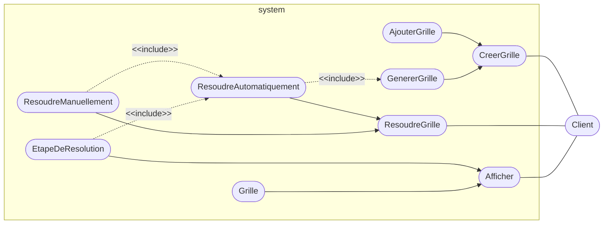
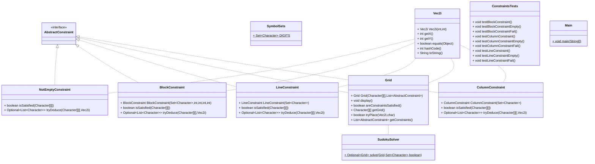

# SUUUUUUUUUUUudoku

Projet mené par Eymeric Dechelette, Thibaut Laracine et Guillaume Calderon

### Diagramme de cas d'utilisation :



### Diagramme de classes :

<!-- BEGIN_CLASS -->

<!-- END_CLASS -->

### Diagramme de séquence :

```
Todo
```

