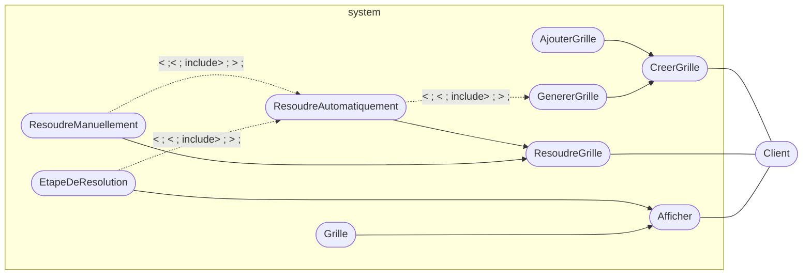

# SUUUUUUUUUUUudoku

Projet mené par Eymeric Dechelette, Thibaut Laracine et Guillaume Calderon

## Fonctionnalités

Ce SUUUUUUUUUUUudoku dispose des fonctionalité suivantes :

- Génération de grille

  Vous pouvez générer une grille de sudoku de taille avec des performance résonnable jusqu'a 16\*16

- Résolution de grille

  Vous pouvez résoudre une grille de sudoku de taille avec des performance résonnable jusqu'a 100\*100
  Vous pouvez aussi résoudre des multi-doku (prés codé via des fichier dans le dossier
  `src/test/resources`)

- Consulter l'historique des modifications

  Vous pouvez consulter l'historique des modifications de la grille (particulièrement utile pour les résolutions
  automatique)

- Résolution manuelle

  Vous pouvez résoudre une grille de sudoku de manière manuelle

- Interface graphique

  Vous pouvez utiliser une interface graphique pour jouer au sudokus

- Interface en ligne de commande

  Vous pouvez utiliser une interface en ligne de commande pour jouer au sudokus

## Utilisation

### Lancer le programme

#### Utilisateur nix

La methode privilégiée pour lancer le programme est d'utiliser nix, car celui-ci vous assure d'avoir un environement
identique au autre utilisateur de nix.

Si vous disposez de nix, vous pouvez lancer la compilation avec la commande suivante :

```bash
nix build
```

Vous pouvez ensuite lancer les differents executables avec les commande suivante :

```bash
./result/bin/tui # Interface en ligne de commande
./result/bin/imGUI # Interface graphique avec imGUI
./result/bin/swing # Interface graphique avec swing
```

#### Utilisateur linux classique

Il vous faudra installer les dépendances suivantes :

- `openjdk-23`
- `gradle`
- `libGL`

Vous pouvez ensuite lancer la compilation avec la commande suivante :

```bash
./gradlew buildAllJars
```

Vous pouvez ensuite lancer les differents executables avec les commande suivante :

```bash
java -jar ./build/libs/imGUI-1.0-SNAPSHOT.jar # Interface en ligne de commande
java -jar ./build/libs/tui-1.0-SNAPSHOT.jar # Interface graphique avec imGUI
java -jar ./build/libs/swing-1.0-SNAPSHOT.jar # Interface graphique avec swing
```

### Diagramme de cas d'utilisation :



### Diagramme de classes :

```mermaid
classDiagram
    direction BT
    class AbstractConstraint {
        <<Interface>>
        + isSatisfied(InnerGrid) boolean
        + isAffectedBy(Vec2i, Vec2i) boolean
        + getPossibilities(InnerGrid, Vec2i) Optional~Set~Integer~~
        + isPosAffected(Vec2i) boolean
        + getClassicConstraints(int, Set~Integer~) List~AbstractConstraint~
        + getRectConstraints(int, int, Set~Integer~) List~AbstractConstraint~
    }
    class BlockConstraint {
        + BlockConstraint(Set~Integer~, Box2D)
        + isAffectedBy(Vec2i, Vec2i) boolean
        + isSatisfied(InnerGrid) boolean
        - extractBlock(InnerGrid) Set~Integer~
        + isInBlock(Vec2i) boolean
        + getPossibilities(InnerGrid, Vec2i) Optional~Set~Integer~~
        + equals(Object) boolean
        + hashCode() int
        + isPosAffected(Vec2i) boolean
        Box2D block
    }
    class Box2D {
        + Box2D(Vec2i, Vec2i)
        + Box2D(int, int, int, int)
        + absolute() Box2D
        + x() int
        + dx() int
        + overlap(Box2D) Box2D
        + height() int
        + contains(Vec2i) boolean
        + absolute(int, int, int, int) Box2D
        + dy() int
        + width() int
        + offset(int, int) Box2D
        + equals(Object) boolean
        + hashCode() int
        + contains(int, int) boolean
        + substract(Box2D) Box2D
        + y() int
    }
    class ColumnConstraint {
        + ColumnConstraint(Set~Integer~)
        + isSatisfied(InnerGrid) boolean
        + isAffectedBy(Vec2i, Vec2i) boolean
        + getPossibilities(InnerGrid, Vec2i) Optional~Set~Integer~~
        + isPosAffected(Vec2i) boolean
    }
    class CsvUtils {
        + CsvUtils()
        + exportGrid(Path, Grid) void
        + importMultiGrid(Path) MultiGrid
        + importGrid(Path) Integer[][]
        + exportMultiGrid(Path, MultiGrid) void
    }
    class DiagonalConstraint {
        + DiagonalConstraint(Set~Integer~)
        + isAffectedBy(Vec2i, Vec2i) boolean
        + isSatisfied(InnerGrid) boolean
        + getPossibilities(InnerGrid, Vec2i) Optional~Set~Integer~~
        + isPosAffected(Vec2i) boolean
    }
    class Difficulty {
        <<enumeration>>
        + Difficulty()
        + fromInt(int) Difficulty
        + values() Difficulty[]
        + valueOf(String) Difficulty
        String[] values
        int value
    }
    class GeneralSymbolConstraint {
        + GeneralSymbolConstraint(Set~Integer~, Vec2i[])
        - Vec2i[] positionList
        + isSatisfied(InnerGrid) boolean
        - extractValues(InnerGrid) Set~Integer~
        + isPosAffected(Vec2i) boolean
        - isInPositionList(Vec2i) boolean
        + isAffectedBy(Vec2i, Vec2i) boolean
        + getPossibilities(InnerGrid, Vec2i) Optional~Set~Integer~~
        Vec2i[] positionList
    }
    class Generator {
        + Generator()
        - removeRandomCells(T, int, Difficulty) void
        + fastSolvedGridCreation(int, int) Grid
        ~ createRandomConstraints(Grid) List~AbstractConstraint~
        + createExempleSolvedSudoku(int, int) Grid
        + generateSudokuWithBlockConstraints(int, int, Difficulty) Grid
        + generateClassicSudoku(int, Difficulty) Grid
        + printGrid(Integer[][]) void
        + generateSudokuWithRandomBlockConstraint(int, Difficulty) Grid
        + generateMultigridSudoku(int, int, Difficulty) MultiGrid
        - findDividers(int) Vec2i
        - createSolvedSudoku(int, int) Grid
    }
    class Grid {
        + Grid(Integer[][], Set~Integer~)
        + Grid(Grid)
        + Grid(Integer[][], Set~Integer~, int, int)
        + Grid(Integer[][], List~AbstractConstraint~, Set~Integer~)
        - ArrayList~Move2i~ moves
        - InnerGrid innerGrid
        ~ List~AbstractConstraint~ constraints
        - HashMap~Vec2i, Set~ Integer~~ emptyCellsPossibilities
        + computeAllEmptyCellsPossibilities() void
        + placeUnchecked(Vec2i, Integer, boolean, boolean) void
        + areConstraintsSatisfied(boolean) boolean
        + getSymbolAt(Vec2i) Integer
        + tryPlace(Vec2i, Integer, boolean, boolean) boolean
        + display() void
        + getSymbolAt(int, int) Integer
        + length() int
        + undoLastMove(boolean) void
        + shallowCopy() Grid
        + computeChangedEmptyCellsPossibilities(Vec2i, boolean) void
        + cleanMoves() void
        + applyNakedPairs() boolean
        InnerGrid innerGrid
        Vec2i size
        List~Move2i~ moves
        Set~Integer~ symbols
        List~AbstractConstraint~ constraints
        HashMap~Vec2i, Set~ Integer~~ emptyCellsPossibilities
    }
    class GridListener {
        <<Interface>>
        + onGridChange(InnerGrid) void
    }
    class ImGUIFrame {
        + ImGUIFrame()
        - drawGrid(Grid, Vec2i, ImVec2) void
        # configure(Configuration) void
        - keyPress(int) void
        - setSelection(int, int) void
        + main(String[]) void
        # preRun() void
        - drawMultiGrid(MultiGrid, Vec2i, ImVec2) void
        - applyLastChanges() void
        - handleInput() void
        + process() void
        Integer? currentSymbol
    }
    class InnerGrid {
        + InnerGrid(Integer[][])
        + InnerGrid(InnerGrid)
        + set(Vec2i, Integer) void
        + get() Integer[][]
        + display() void
        + length() int
        + computeEmptyCells() HashSet~Vec2i~
        + at(Vec2i) Integer
        + hashCode() int
        + equals(Object) boolean
    }
    class LineConstraint {
        + LineConstraint(Set~Integer~)
        + isPosAffected(Vec2i) boolean
        + isSatisfied(InnerGrid) boolean
        + isAffectedBy(Vec2i, Vec2i) boolean
        + getPossibilities(InnerGrid, Vec2i) Optional~Set~Integer~~
    }
    class Main {
        + Main()
        + main(String[]) void
    }
    class Move2i {
        + Move2i(Vec2i, Integer, Integer)
        + position() Vec2i
        + toString() String
        + previous_value() Integer
        + value() Integer
    }
    class MultiGrid {
        + MultiGrid(List~Pair~ Vec2i, Grid~~)
        + MultiGrid(MultiGrid)
        - Grid[] grids
        - Vec2i[] paddings
        - Vec2i size
        - List~Move2i~ moves
        - HashMap~Vec2i, Set~ Integer~~ emptyCellsPossibilities
        + getGridFor(int, int) Pair~Integer, Grid~
        + fillOverlappingCells() void
        + computeAllEmptyCellsPossibilities() void
        + areConstraintsSatisfied(boolean) boolean
        + placeUnchecked(Vec2i, Integer, boolean, boolean) void
        + cleanMoves() void
        + isNotInGrid(Vec2i) boolean
        + undoLastMove(boolean) void
        + shallowCopy() MultiGrid
        + gatherEmptyCellsPossibilities() void
        + isInGrid(Vec2i) boolean
        + getSymbolAt(Vec2i) Integer
        + display() void
        Vec2i[] randomPadding
        Map~Vec2i, Set~ Integer~~ emptyCellsPossibilities
        Vec2i size
        List~Move2i~ moves
        Vec2i[] paddings
        Grid[] grids
    }
    class NotEmptyConstraint {
        + NotEmptyConstraint()
        + isAffectedBy(Vec2i, Vec2i) boolean
        + isPosAffected(Vec2i) boolean
        + getPossibilities(InnerGrid, Vec2i) Optional~Set~Integer~~
        + isSatisfied(InnerGrid) boolean
    }
    class ObservableGrid {
        + ObservableGrid(Grid, GridListener)
        - Grid grid
        + computeAllEmptyCellsPossibilities() void
        + placeUnchecked(Vec2i, Integer, boolean, boolean) void
        + undoLastMove(boolean) void
        + cleanMoves() void
        + areConstraintsSatisfied(boolean) boolean
        + shallowCopy() ObservableGrid
        + getSymbolAt(Vec2i) Integer
        Map~Vec2i, Set~ Integer~~ emptyCellsPossibilities
        Grid grid
        Vec2i size
        List~Move2i~ moves
    }
    class Pair~K, V~ {
+ Pair(K, V)
- K first
- V second
K first
V second
}
class Solvable~T~ {
# Solvable(Set~Integer~)
~ Set~Integer~ symbols
+ cleanMoves() void
+ areConstraintsSatisfied(boolean) boolean
+ getSymbolAt(Vec2i) Integer
+ shallowCopy() T
+ undoLastMove(boolean) void
+ computeAllEmptyCellsPossibilities() void
+ placeUnchecked(Vec2i, Integer, boolean, boolean) void
boolean solved
Map~Vec2i, Set~ Integer~~ emptyCellsPossibilities
Vec2i size
List~Move2i~ moves
Set~Integer~ symbols
}
class SolvingState {
<<enumeration>>
+ SolvingState()
+ values() SolvingState[]
+ valueOf(String) SolvingState
}
class SudokuBoard {
~ SudokuBoard(Grid)
+ recoverPreviousSudoku(Grid) void
+ update(Integer[][], boolean) void
}
class SudokuFrame {
+ SudokuFrame(Grid)
+ main(String[]) void
- updateJpanel() void
}
class SudokuOptions {
+ SudokuOptions(Color, Runnable, Runnable, Runnable, Runnable, Runnable, Runnable)
- applyMaterialDesign(JButton) void
}
class SudokuSolver {
+ SudokuSolver()
+ findAllSolutions(T, boolean, boolean, boolean) List~T~
+ hasMoreThanOneSolution(T, boolean, boolean) boolean
- solveDeduction(T, boolean) SolvingState
+ solve(T, boolean, boolean, boolean) Pair~SolvingState, T~
- doBacktracking(T, boolean) List~T~
}
class SymbolSets {
+ SymbolSets()
+ generateSymbols(int) Set~Integer~
}
class Tui {
+ Tui()
- welcomeMessage() void
- displayGrid(Grid, Vec2i) void
- play(Solvable~?~) void
- showTimeLine(int, int) void
+ main(String[]) void
- stopLoader() void
- selectMode(String[]) int
~ start() void
- startLoader() void
- gameOver() void
- cleanTerminal() void
- solve(Solvable~?~) Solvable~?~
- displayMultiGrid(MultiGrid) void
- showHelper() void
- displayOptions(String[], int) void
}
class Utils {
+ Utils()
+ hslToRgb(float, float, float) int[]
+ applyMapping(O[][], M[][], HashMap~O, M~) void
}
class Vec2i {
+ Vec2i(Vec2i)
+ Vec2i(int, int)
- int x
- int y
+ zero() Vec2i
+ equals(int, int) boolean
+ random(int, int) Vec2i
+ equals(Object) boolean
+ substract(Vec2i) Vec2i
+ absolute() Vec2i
+ toString() String
+ hashCode() int
+ add(Vec2i) Vec2i
int x
int y
}

AbstractConstraint  ..>  BlockConstraint: «create»
AbstractConstraint  ..>  Box2D: «create»
AbstractConstraint  ..>  ColumnConstraint : «create»
AbstractConstraint  ..>  LineConstraint: «create»
AbstractConstraint  ..>  NotEmptyConstraint: «create»
BlockConstraint  ..>  AbstractConstraint
BlockConstraint "1" *--> "box 1" Box2D
ColumnConstraint  ..>  AbstractConstraint
CsvUtils  ..>  Grid: «create»
CsvUtils  ..>  MultiGrid : «create»
CsvUtils  ..>  Pair~K, V~: «create»
CsvUtils  ..>  Vec2i: «create»
DiagonalConstraint  ..>  AbstractConstraint
GeneralSymbolConstraint  ..>  AbstractConstraint
GeneralSymbolConstraint "1" *--> "positionList *" Vec2i
Generator  ..>  ColumnConstraint: «create»
Generator  ..>  GeneralSymbolConstraint: «create»
Generator  ..>  Grid: «create»
Generator  ..>  LineConstraint: «create»
Generator  ..>  MultiGrid: «create»
Generator  ..>  NotEmptyConstraint: «create»
Generator  ..>  Pair~K, V~: «create»
Generator  ..>  Vec2i: «create»
Grid "1" *--> "constraints *" AbstractConstraint
Grid  ..>  InnerGrid: «create»
Grid "1" *--> "innerGrid 1" InnerGrid
Grid "1" *--> "moves *" Move2i
Grid  ..>  Move2i: «create»
Grid  -->  Solvable~T~
Grid "1" *--> "emptyCellsPossibilities *" Vec2i
Grid  ..>  Vec2i: «create»
ImGUIFrame  ..>  Grid: «create»
ImGUIFrame  ..>  ObservableGrid: «create»
ImGUIFrame "1" *--> "originalSolvable 1" Solvable~T~
ImGUIFrame "1" *--> "selected_pos 1" Vec2i
ImGUIFrame  ..>  Vec2i: «create»
InnerGrid  ..>  Vec2i: «create»
LineConstraint  ..>  AbstractConstraint
Move2i "1" *--> "position 1" Vec2i
MultiGrid  ..>  Box2D: «create»
MultiGrid "1" *--> "grids *" Grid
MultiGrid "1" *--> "moves *" Move2i
MultiGrid  ..>  Move2i: «create»
MultiGrid  ..>  Pair~K, V~: «create»
MultiGrid  -->  Solvable~T~
MultiGrid "1" *--> "paddings *" Vec2i
MultiGrid  ..>  Vec2i: «create»
NotEmptyConstraint  ..>  AbstractConstraint
ObservableGrid "1" *--> "grid 1" Grid
ObservableGrid "1" *--> "listener 1" GridListener
ObservableGrid  -->  Solvable~T~
SudokuBoard "1" *--> "previousGrid 1" Grid
SudokuBoard  ..>  Grid: «create»
SudokuBoard  ..>  Vec2i: «create»
SudokuFrame "1" *--> "grid 1" Grid
SudokuFrame  ..>  Grid : «create»
SudokuFrame  ..>  SudokuBoard: «create»
SudokuFrame "1" *--> "board 1" SudokuBoard
SudokuFrame  ..>  SudokuOptions: «create»
SudokuSolver  ..>  Pair~K, V~: «create»
Tui  ..>  Grid: «create»
Tui  ..>  MultiGrid: «create»
Tui  ..>  Pair~K, V~: «create»
Tui  ..>  Vec2i: «create»
```

<!-- BEGIN_CLASS -->



<!-- END_CLASS -->

### Diagramme d'activité du générateur :

```
TODO
```

### Diagramme d'activité du solveur :


