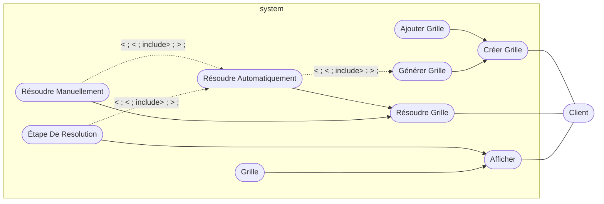
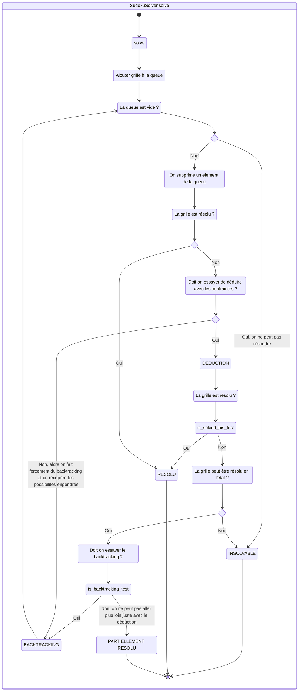
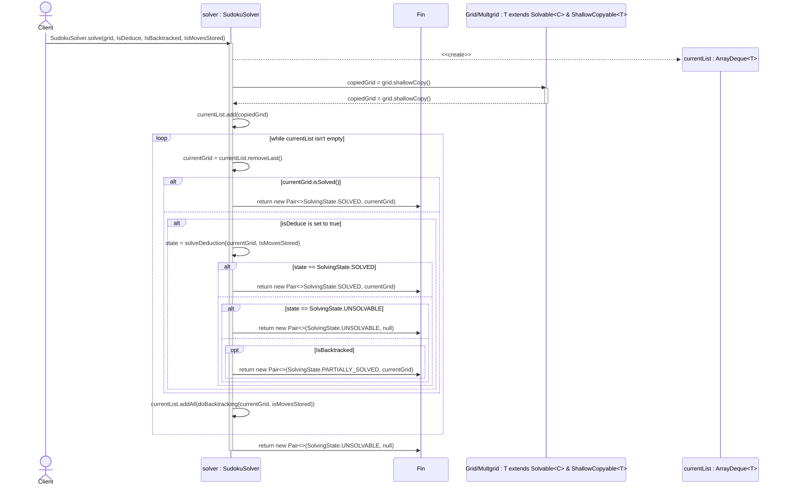

# SUUUUUUUUUUUudoku

Projet mené par Eymeric Dechelette, Thibaut Laracine et Guillaume Calderon

## Fonctionnalités

Ce SUUUUUUUUUUUudoku dispose des fonctionnalités suivantes :

- Génération de grille

  Vous pouvez générer une grille de sudoku de taille avec des performances raisonnables jusqu'à 16\*16.

- Résolution de grille

  Vous pouvez résoudre une grille de sudoku de taille avec des performances raisonnables jusqu'à 100\*100.
  Vous pouvez aussi résoudre des multi-doku (pré-codé via des fichiers dans le dossier
  `src/test/resources`)

- Consulter l'historique des modifications

  Vous pouvez consulter l'historique des modifications de la grille (particulièrement utile pour les résolutions
  automatiques).

- Résolution manuelle

  Vous pouvez résoudre une grille de sudoku de manière manuelle

- Interface graphique

  Vous pouvez utiliser une interface graphique pour jouer au sudoku

- Interface en ligne de commande

  Vous pouvez utiliser une interface en ligne de commande pour jouer au sudoku

## Utilisation

### Lancer le programme

#### Utilisateur nix

La methode privilégiée pour lancer le programme est d'utiliser nix, car celui-ci vous assure d'avoir un environnement
identique au autre utilisateur de nix.

Si vous disposez de nix, vous pouvez lancer la compilation avec la commande suivante :

```bash
nix build
```

Vous pouvez ensuite lancer les différents executables avec les commandes suivantes :

```bash
./result/bin/tui # Interface en ligne de commande
./result/bin/imGUI # Interface graphique avec imGUI
./result/bin/swing # Interface graphique avec swing
```

#### Utilisateur linux classique

Il vous faudra installer les dépendances suivantes :

- `openjdk-23`
- `gradle`
- `libGL`

Vous pouvez ensuite lancer la compilation avec la commande suivante :

```bash
./gradlew buildAllJars
```

Vous pouvez ensuite lancer les différents executables avec les commandes suivantes :

```bash
java -jar ./build/libs/imGUI-1.0-SNAPSHOT.jar # Interface en ligne de commande
java -jar ./build/libs/tui-1.0-SNAPSHOT.jar # Interface graphique avec imGUI
java -jar ./build/libs/swing-1.0-SNAPSHOT.jar # Interface graphique avec swing
```

### Diagramme de cas d'utilisation :



### Diagramme de classes :

```mermaid
---
config:
layout: elk
---
classDiagram
  direction TB
  namespace Ui {
    class ImGUIFrame {
      Integer? currentSymbol
      + ImGUIFrame()
      - drawGrid(Grid, Vec2i, ImVec2) void
      # configure(Configuration) void
      - keyPress(int) void
      - setSelection(int, int) void
      + main(String[]) void
      # preRun() void
      - drawMultiGrid(MultiGrid, Vec2i, ImVec2) void
      - applyLastChanges() void
      - handleInput() void
      + process() void
    }
    class Tui {
      + Tui()
      - welcomeMessage() void
      - displayGrid(Grid, Vec2i) void
      - play(Solvable~?~) void
      - showTimeLine(int, int) void
      + main(String[]) void
      - stopLoader() void
      - selectMode(String[]) int
      ~ start() void
      - startLoader() void
      - gameOver() void
      - cleanTerminal() void
      - solve(Solvable~?~) Solvable~?~
      - displayMultiGrid(MultiGrid) void
      - showHelper() void
      - displayOptions(String[], int) void
    }
    class SudokuOptions {
      + SudokuOptions(Color, Runnable, Runnable, Runnable, Runnable, Runnable, Runnable)
      - applyMaterialDesign(JButton) void
    }
    class SudokuFrame {
      + SudokuFrame(Grid)
      + main(String[]) void
      - updateJpanel() void
    }
    class SudokuBoard {
      ~ SudokuBoard(Grid)
      + recoverPreviousSudoku(Grid) void
      + update(Integer[][], boolean) void
    }
    class ObservableGrid {
      - Grid grid
      Map~Vec2i, Set~ Integer~~ emptyCellsPossibilities
      Grid grid
      Vec2i size
      List~Move2i~ moves
      + ObservableGrid(Grid, GridListener)
      + computeAllEmptyCellsPossibilities() void
      + placeUnchecked(Vec2i, Integer, boolean, boolean) void
      + undoLastMove(boolean) void
      + cleanMoves() void
      + areConstraintsSatisfied(boolean) boolean
      + shallowCopy() ObservableGrid
      + getSymbolAt(Vec2i) Integer
    }
    class GridListener {
      + onGridChange(InnerGrid) void
    }
  }
  namespace Constraints {
    class GeneralSymbolConstraint {
      - Vec2i[] positionList
      Vec2i[] positionList
      + GeneralSymbolConstraint(Set~Integer~, Vec2i[])
      + isSatisfied(InnerGrid) boolean
      - extractValues(InnerGrid) Set~Integer~
      + isPosAffected(Vec2i) boolean
      - isInPositionList(Vec2i) boolean
      + isAffectedBy(Vec2i, Vec2i) boolean
      + getPossibilities(InnerGrid, Vec2i) Optional~Set~Integer~~
    }
    class DiagonalConstraint {
      + DiagonalConstraint(Set~Integer~)
      + isAffectedBy(Vec2i, Vec2i) boolean
      + isSatisfied(InnerGrid) boolean
      + getPossibilities(InnerGrid, Vec2i) Optional~Set~Integer~~
      + isPosAffected(Vec2i) boolean
    }
    class BlockConstraint {
      Box2D block
      + BlockConstraint(Set~Integer~, Box2D)
      + isAffectedBy(Vec2i, Vec2i) boolean
      + isSatisfied(InnerGrid) boolean
      - extractBlock(InnerGrid) Set~Integer~
      + isInBlock(Vec2i) boolean
      + getPossibilities(InnerGrid, Vec2i) Optional~Set~Integer~~
      + equals(Object) boolean
      + hashCode() int
      + isPosAffected(Vec2i) boolean
    }
    class AbstractConstraint {
      + isSatisfied(InnerGrid) boolean
      + isAffectedBy(Vec2i, Vec2i) boolean
      + getPossibilities(InnerGrid, Vec2i) Optional~Set~Integer~~
      + isPosAffected(Vec2i) boolean
      + getClassicConstraints(int, Set~Integer~) List~AbstractConstraint~
      + getRectConstraints(int, int, Set~Integer~) List~AbstractConstraint~
    }
    class NotEmptyConstraint {
      + NotEmptyConstraint()
      + isAffectedBy(Vec2i, Vec2i) boolean
      + isPosAffected(Vec2i) boolean
      + getPossibilities(InnerGrid, Vec2i) Optional~Set~Integer~~
      + isSatisfied(InnerGrid) boolean
    }
    class LineConstraint {
      + LineConstraint(Set~Integer~)
      + isPosAffected(Vec2i) boolean
      + isSatisfied(InnerGrid) boolean
      + isAffectedBy(Vec2i, Vec2i) boolean
      + getPossibilities(InnerGrid, Vec2i) Optional~Set~Integer~~
    }
    class ColumnConstraint {
      + ColumnConstraint(Set~Integer~)
      + isSatisfied(InnerGrid) boolean
      + isAffectedBy(Vec2i, Vec2i) boolean
      + getPossibilities(InnerGrid, Vec2i) Optional~Set~Integer~~
      + isPosAffected(Vec2i) boolean
    }
  }
  namespace UtilsNamespace {
class Box2D {
+ Box2D(Vec2i, Vec2i)
+ Box2D(int, int, int, int)
+ absolute() Box2D
+ x() int
+ dx() int
+ overlap(Box2D) Box2D
+ height() int
+ contains(Vec2i) boolean
+ absolute(int, int, int, int) Box2D
+ dy() int
+ width() int
+ offset(int, int) Box2D
+ equals(Object) boolean
+ hashCode() int
+ contains(int, int) boolean
+ substract(Box2D) Box2D
+ y() int
}
class Vec2i {
- int x
- int y
int x
int y
+ Vec2i(Vec2i)
+ Vec2i(int, int)
+ zero() Vec2i
+ equals(int, int) boolean
+ random(int, int) Vec2i
+ equals(Object) boolean
+ substract(Vec2i) Vec2i
+ absolute() Vec2i
+ toString() String
+ hashCode() int
+ add(Vec2i) Vec2i
}
class Move2i {
+ Move2i(Vec2i, Integer, Integer)
+ position() Vec2i
+ toString() String
+ previous_value() Integer
+ value() Integer
}
class Pair~K, V~ {
- K first
- V second
K first
V second
+ Pair(K, V)
}
class Difficulty {
String[] values
int value
+ Difficulty()
+ fromInt(int) Difficulty
+ values() Difficulty[]
+ valueOf(String) Difficulty
}
class CsvUtils {
+ CsvUtils()
+ exportGrid(Path, Grid) void
+ importMultiGrid(Path) MultiGrid
+ importGrid(Path) Integer[][]
+ exportMultiGrid(Path, MultiGrid) void
}
class Main {
+ Main()
+ main(String[]) void
}
class Utils {
+ Utils()
+ hslToRgb(float, float, float) int[]
+ applyMapping(O[][], M[][], HashMap~O, M~) void
}
}
namespace GridNamespace {
class Grid {
- ArrayList~Move2i~ moves
- InnerGrid innerGrid
~ List~AbstractConstraint~ constraints
- HashMap~Vec2i, Set~ Integer~~ emptyCellsPossibilities
InnerGrid innerGrid
Vec2i size
List~Move2i~ moves
Set~Integer~ symbols
List~AbstractConstraint~ constraints
HashMap~Vec2i, Set~ Integer~~ emptyCellsPossibilities
+ Grid(Integer[][], Set~Integer~)
+ Grid(Grid)
+ Grid(Integer[][], Set~Integer~, int, int)
+ Grid(Integer[][], List~AbstractConstraint~, Set~Integer~)
+ computeAllEmptyCellsPossibilities() void
+ placeUnchecked(Vec2i, Integer, boolean, boolean) void
+ areConstraintsSatisfied(boolean) boolean
+ getSymbolAt(Vec2i) Integer
+ tryPlace(Vec2i, Integer, boolean, boolean) boolean
+ display() void
+ getSymbolAt(int, int) Integer
+ length() int
+ undoLastMove(boolean) void
+ shallowCopy() Grid
+ computeChangedEmptyCellsPossibilities(Vec2i, boolean) void
+ cleanMoves() void
+ applyNakedPairs() boolean
}
class InnerGrid {
+ InnerGrid(Integer[][])
+ InnerGrid(InnerGrid)
+ set(Vec2i, Integer) void
+ get() Integer[][]
+ display() void
+ length() int
+ computeEmptyCells() HashSet~Vec2i~
+ at(Vec2i) Integer
+ hashCode() int
+ equals(Object) boolean
}
class MultiGrid {
- Grid[] grids
- Vec2i[] paddings
- Vec2i size
- List~Move2i~ moves
- HashMap~Vec2i, Set~ Integer~~ emptyCellsPossibilities
Vec2i[] randomPadding
Map~Vec2i, Set~ Integer~~ emptyCellsPossibilities
Vec2i size
List~Move2i~ moves
Vec2i[] paddings
Grid[] grids
+ MultiGrid(List~Pair~ Vec2i, Grid~~)
+ MultiGrid(MultiGrid)
+ getGridFor(int, int) Pair~Integer, Grid~
+ fillOverlappingCells() void
+ computeAllEmptyCellsPossibilities() void
+ areConstraintsSatisfied(boolean) boolean
+ placeUnchecked(Vec2i, Integer, boolean, boolean) void
+ cleanMoves() void
+ isNotInGrid(Vec2i) boolean
+ undoLastMove(boolean) void
+ shallowCopy() MultiGrid
+ gatherEmptyCellsPossibilities() void
+ isInGrid(Vec2i) boolean
+ getSymbolAt(Vec2i) Integer
+ display() void
}
class Solvable~T~ {
~ Set~Integer~ symbols
boolean solved
Map~Vec2i, Set~ Integer~~ emptyCellsPossibilities
Vec2i size
List~Move2i~ moves
Set~Integer~ symbols
# Solvable(Set~Integer~)
+ cleanMoves() void
+ areConstraintsSatisfied(boolean) boolean
+ getSymbolAt(Vec2i) Integer
+ shallowCopy() T
+ undoLastMove(boolean) void
+ computeAllEmptyCellsPossibilities() void
+ placeUnchecked(Vec2i, Integer, boolean, boolean) void
}
class SymbolSets {
+ SymbolSets()
+ generateSymbols(int) Set~Integer~
}
 }
namespace Solver {
class SolvingState {
+ SolvingState()
+ values() SolvingState[]
+ valueOf(String) SolvingState
 }
class Generator {
+ Generator()
- removeRandomCells(T, int, Difficulty) void
+ fastSolvedGridCreation(int, int) Grid
~ createRandomConstraints(Grid) List~AbstractConstraint~
+ createExempleSolvedSudoku(int, int) Grid
+ generateSudokuWithBlockConstraints(int, int, Difficulty) Grid
+ generateClassicSudoku(int, Difficulty) Grid
+ printGrid(Integer[][]) void
+ generateSudokuWithRandomBlockConstraint(int, Difficulty) Grid
+ generateMultigridSudoku(int, int, Difficulty) MultiGrid
- findDividers(int) Vec2i
- createSolvedSudoku(int, int) Grid
}
class SudokuSolver_copy_1["SudokuSolver"] {
+ SudokuSolver()
+ findAllSolutions(T, boolean, boolean, boolean) List~T~
+ hasMoreThanOneSolution(T, boolean, boolean) boolean
- solveDeduction(T, boolean) SolvingState
+ solve(T, boolean, boolean, boolean) Pair~SolvingState, T~
- doBacktracking(T, boolean) List~T~
}
 }
<<Interface>> AbstractConstraint
<<enumeration>> Difficulty
<<Interface>> GridListener
<<enumeration>> SolvingState
SudokuFrame ..> SudokuOptions: «create»
BlockConstraint ..> AbstractConstraint
ColumnConstraint ..> AbstractConstraint
CsvUtils ..> Grid: «create»
CsvUtils ..> MultiGrid: «create»
DiagonalConstraint ..> AbstractConstraint
GeneralSymbolConstraint ..> AbstractConstraint
Generator ..> ColumnConstraint: «create»
Generator ..> GeneralSymbolConstraint: «create»
Generator ..> Grid : «create»
Generator ..> LineConstraint: «create»
Generator ..> MultiGrid: «create»
Generator ..> NotEmptyConstraint: «create»
Grid "1" *--> "constraints *" AbstractConstraint
Grid ..> InnerGrid : «create»
Grid "1" *--> "innerGrid 1" InnerGrid
Grid --> Solvable
ImGUIFrame ..> Grid: «create»
ImGUIFrame ..> ObservableGrid: «create»
ImGUIFrame "1" *--> "originalSolvable 1" Solvable
LineConstraint ..> AbstractConstraint
MultiGrid "1" *--> "grids *" Grid
MultiGrid --> Solvable
NotEmptyConstraint ..> AbstractConstraint
ObservableGrid "1" *--> "grid 1" Grid
ObservableGrid "1" *--> "listener 1" GridListener
ObservableGrid --> Solvable
SudokuBoard "1" *--> "previousGrid 1" Grid
SudokuBoard ..> Grid: «create»
SudokuFrame "1" *--> "grid 1" Grid
SudokuFrame ..> Grid: «create»
SudokuFrame ..> SudokuBoard: «create»
SudokuFrame "1" *--> "board 1" SudokuBoard
Tui ..> Grid: «create»
Tui ..> MultiGrid: «create»
```

<!-- BEGIN_CLASS -->
<!-- END_CLASS -->


### Système général :

```
TODO : diagramme de communication entre les différentes classes au démarrage
ex : Main -> Tui -> Grid
                 -> MultiGrid
                 -> Solver
                 -> Generateur
          -> ImGUIFrame
A voir un peu plus en détail
```

### Grille de sudoku et multi grille (Solvable) :

```
TODO : diagrammes d'états qui montre les différentes agencement que l'on peut avoir
```

### UI :

```
TODO : diagramme d'état transition de l'interface graphique (optionel)
```

### Générateur :

#### Explication de la méthode de génération de grille simple optimisé :

```
TODO : diagramme d'activité et/ou de séquence. 
```

#### Explication de la méthode de génération de multi grille :

```
TODO : diagramme d'activité et/ou de séquence
```

#### Méthode de génération des contraintes pour un sudoku avec des contraintes de blocs de NxM :

```
TODO: diagramme d'activité et/ou de séquence
```

### Solveur :



On peut également observer la méthode de résolution à travers un diagramme de séquence :

