### Lien du Git : [GitHub](https://github.com/FlashOnFire/SUUUUUUUUUUUudoku)

# Tutoriel utilisation

## Prérequis

Si vous n'utilisez pas nix, les prérequis sont :

- `openjdk-23`
- `gradle`
- `libGL`

## Jar précompilés

Vous pouvez lancer les fichiers en .jar dans le dossier build

```bash
java -jar ./build/libs/imGUI-1.0.jar # Interface graphique avec imGUI
java -jar ./build/libs/tui-1.0.jar # Interface en ligne de commande
java -jar ./build/libs/swing-1.0.jar # Interface graphique avec swing
```

## Compilation

### Utilisateur nix

La méthode privilégiée pour lancer le programme est d'utiliser nix, car celui-ci vous assure d'avoir un environnement
identique aux autres utilisateurs de nix.
Si vous disposez de nix, vous pouvez lancer la compilation avec la commande suivante :

```bash
nix build
```

Vous pouvez ensuite lancer les différents exécutables avec les commandes suivantes :

```bash
./result/bin/tui # Interface en ligne de commande
./result/bin/imGUI # Interface graphique avec imGUI
./result/bin/swing # Interface graphique avec swing
```

### Utilisateur Linux classique

Vous pouvez lancer la compilation avec la commande suivante :

```bash
./gradlew buildAllJars

# pour compiler un seul jar
./gradlew guiImGUIJar
./gradlew guiSwingJar
./gradlew tuiJar
```

Vous pouvez ensuite lancer les différents exécutables avec les commandes suivantes :

```bash
java -jar ./build/libs/imGUI-1.0.jar # Interface graphique avec imGUI
java -jar ./build/libs/tui-1.0.jar # Interface en ligne de commande
java -jar ./build/libs/swing-1.0.jar # Interface graphique avec swing
```

#### Lancer sans compilation par un jar

Vous pouvez également lancer le programme directement via gradle avec ces commandes :

```bash
./gradlew runTui # Interface en ligne de commande
./gradlew runImGUI # Interface graphique avec imGUI
./gradlew runSwing # Interface graphique avec swing
```

---

# Méthodologie

## Articulation entre conception et codage

Pour aborder ce projet, nous avons commencé, après avoir lu attentivement le cahier des charges, par réaliser un
diagramme de cas d'utilisation afin de s'assurer que chaque membre du groupe a parfaitement compris les objectifs requis
de l'application.
Cela nous a permis d'aborder sereinement notre diagramme de classe pour anticiper au mieux l'architecture de notre code.

_Voici le diagramme de cas d'utilisation réalisé au début du projet :_

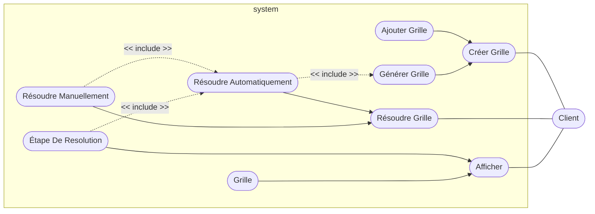

- **Afficher** : Le Client peut afficher une grille de sudoku ou une étape de résolution.
- **Résoudre Grille** : Le Client peut résoudre une grille de sudoku de type Solvable. Il peut choisir de résoudre
  manuellement ou automatiquement.
- **Résoudre Automatiquement** : Le Client peut automatiquement résoudre une grille de sudoku, de type Solvable
  directement en utilisant le solveur.
- **Résoudre Manuellement** : Le Client peut manuellement résoudre une grille de sudoku de type Solvable, via
  l'interface graphique.
- **Générer Grille** : Le Client peut générer une grille de sudoku, de type Solvable, via le générateur, en fonction de
  la difficulté et du type de grille désiré.
- **Ajouter Grille** : Le Client peut ajouter une grille de sudoku, de type Solvable, à la liste des grilles.
- **Créer Grille** : Le Client peut créer une grille de sudoku, de type Solvable, en fonction de la taille et des
  symboles désirés.
- **Étape De Resolution** : Le Client peut afficher une étape de résolution de la grille de sudoku, de type Solvable.

#### Diagramme de classe

Nous avons préféré garder un diagramme de classe le plus minimaliste possible au début, car nous savons par expérience
que nous devons toujours réorganiser le code plusieurs fois lors de son développement.
Éviter de trop architecturer le projet permet de rester agile et de l'adapter au fur et à mesure.
Nous avons ensuite actualisé ce diagramme au fur et à mesure du projet afin d'avoir une vue d'ensemble de notre
organisation et de voir simplement les points améliorables et les répétitions dans notre code.

_Voici le diagramme de classe final mis à jour le 09/02/2025 :_

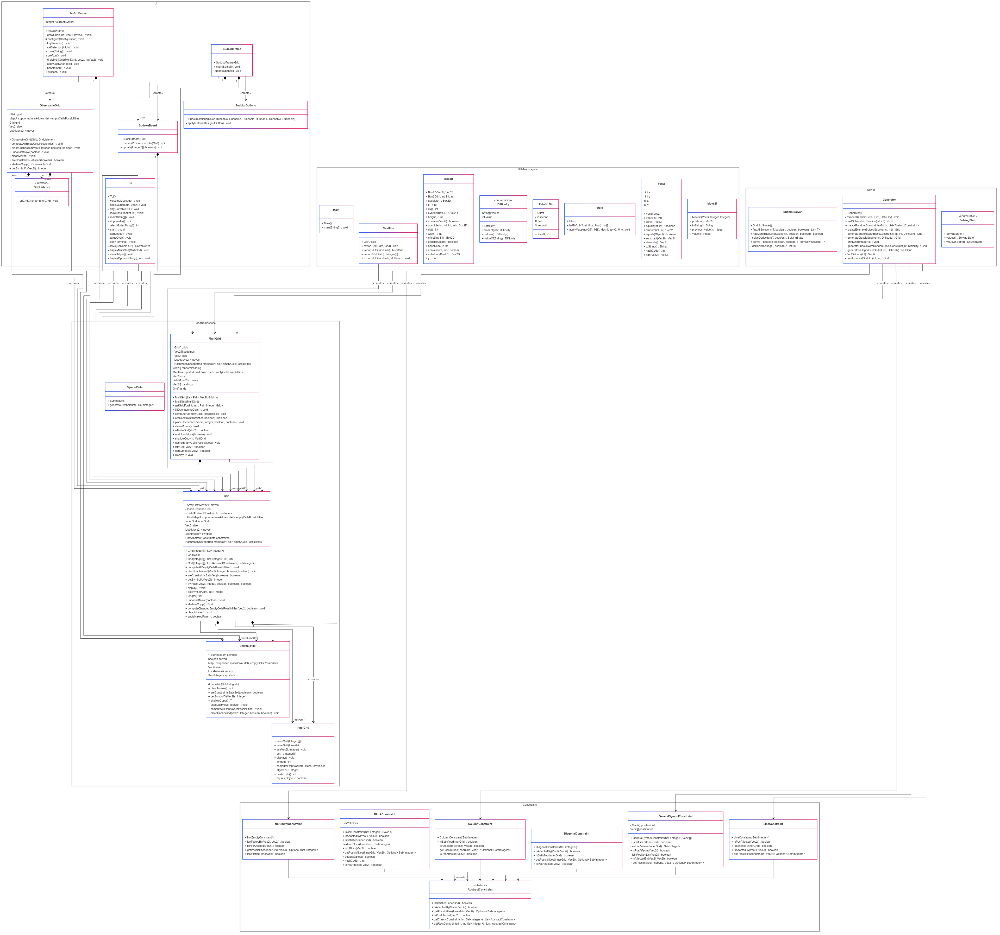

_Voici les diagrammes de classe finaux par package mis à jour le 09/02/2025 :_

---

**Le package des algorithmes** contient les fonctions utiles pour effectuer nos modifications sur nos grilles. C'est ici
que l'on retrouvera notamment le Solveur, ainsi que le Générateur

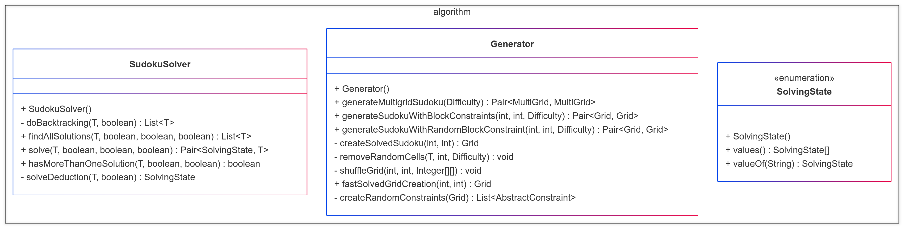

---

**Le package des contraintes** contient toutes les contraintes qui peuvent être utilisées par nos grilles. C'est ici que
l'on pourra ajouter de nouvelles contraintes si besoin, tant que celle-ci hérite de la classe AbstractConstraint.

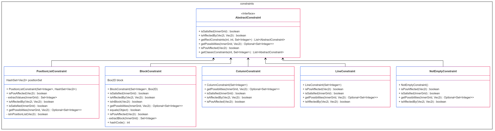

---

**Le package graphique** contient toutes les différentes UI proposées par le projet.

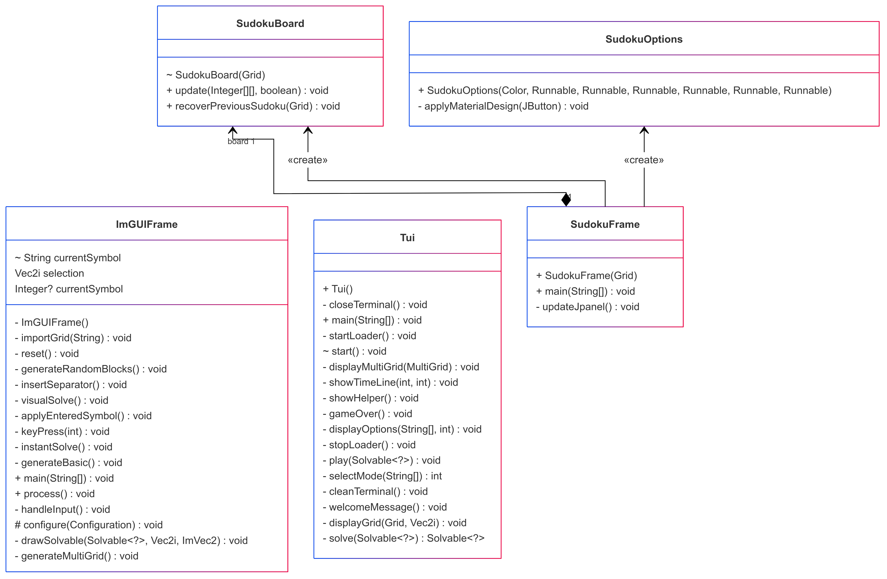

---

**Le package des grilles** contient l'ensemble des types de grilles, ainsi que les classes qui vont servir à
l'utilisation des grilles par d'autres parties du projet.

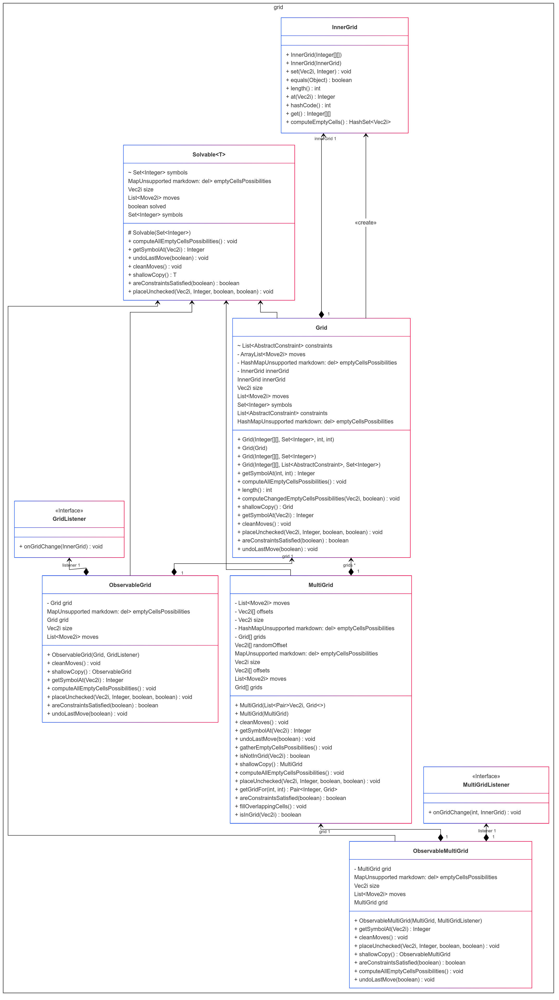

---

**Le package utils**, enfin, contient toutes les petites classes basiques qui vont servir pour implémenter nos objets
plus volumineux.

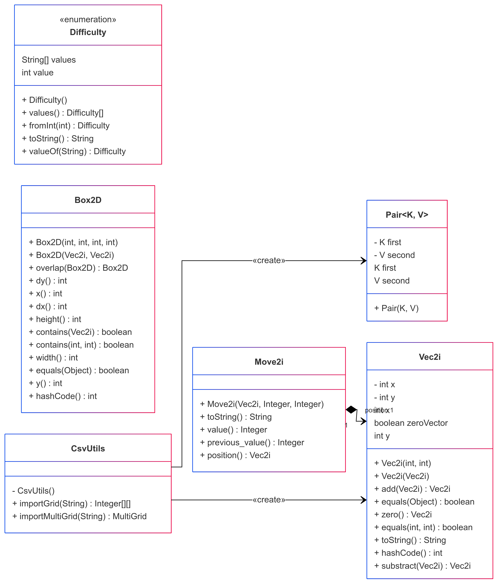

---

# Conception

## Les Grilles et MultiGrille

Nos sudokus sont représentés par une classe abstraite Solvable, qui peut être prise en charge par notre SudokuSolver :

- La classe Grid représente une grille de sudoku classique
- La classe MultiGrid représente une grille de sudoku avec plusieurs grilles (de type Grid). Leurs positions sont
  déterminées par un décalage de positions de référence.

Chaque Solvable possède une liste de contraintes qui lui est propre, ainsi qu'une liste de mouvements qui ont été
effectués par le solveur ou l'utilisateur pour permettre le suivi de la résolution. Les symboles sont les valeurs
pouvant être stockées dans le Solvable.

_Voici un exemple de ce que peut être une grille de type Solvable, à travers un diagramme d'objet :_

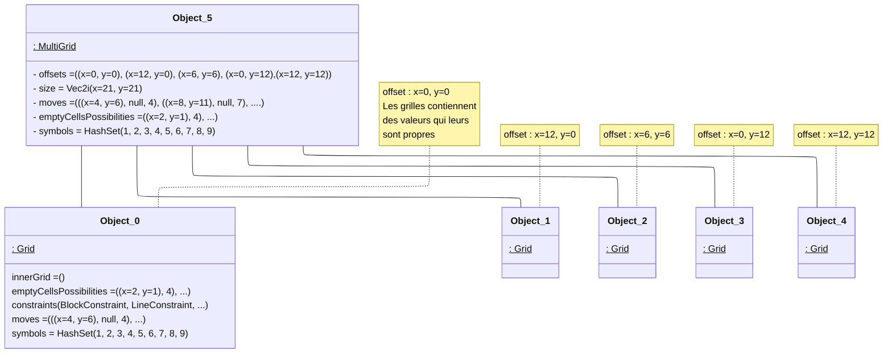

Nous pouvons ainsi obtenir des grilles de sudoku comme celle-ci :


---

# Solveur :

Le Solveur est une classe très importante pour notre projet, étant une fonction majeure très sollicitée et sensible du
projet (utilisé par le générateur, les aides de l'utilisateur, etc.).
Cette fonction se doit d'être la plus rapide possible pour ne pas avoir de ralentissement trop important qui pourrait
nuire à l'expérience utilisateur.

C'est dans ce contexte qu'une attention particulière a été portée sur la question dès le début du projet, et n'a cessé
d'être remis en cause et optimisé pour en arriver là.
La méthode solve() permet de résoudre n'importe quel Solvable, en se basant les contraintes de la grille et/ou en
utilisant le backtracking pour les grilles plus complexes.

_Voici un diagramme d'activité de cette méthode essentielle au bon fonctionnement de notre application :_

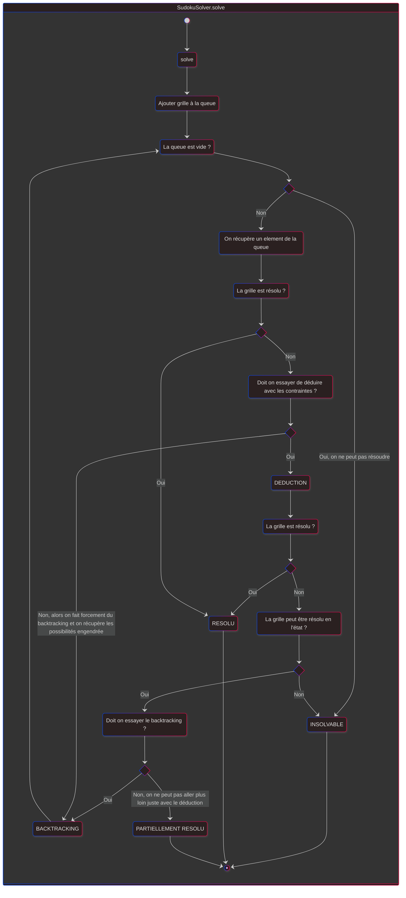

_On peut également observer cette même méthode de résolution à travers un diagramme de séquence :_

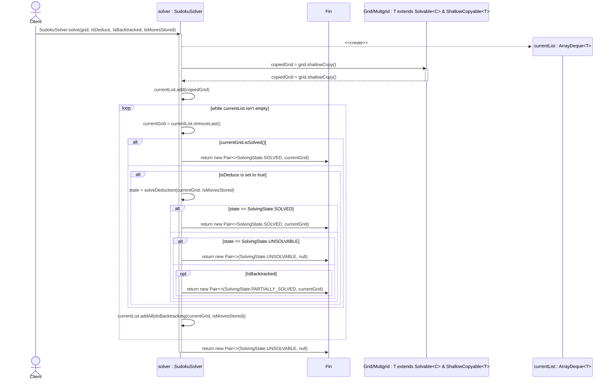

---

# Générateur :

Le Générateur est une classe complexe qui permet de générer des grilles de sudoku de différents types.
En fonction de la fonction de génération appelée, nous pouvons avoir une variété de sudokus :

- Des sudokus avec des contraintes de blocs de taille NxM, avec la fonction `generateSudokuWithBlockConstraints`
- Des sudokus avec des contraintes de valeurs sur des positions (contrainte de blocs déstructurée), avec la fonction
  `generateSudokuWithRandomBlockConstraint`
- Des multi-doku qui génèrent un multi-doku contenant des grilles de sudoku de taille 9x9 avec des formes prédéfinies,
  avec la fonction `generateMultigridSudoku`
  La forme de ces multi-doku peut facilement être enrichie en ajoutant des formes de grilles dans la fonction
  `getRandomOffset`.

Ces trois fonctions utilisant des fonctions communes pour générer leur grille de sudoku, nous avons un fonctionnement du
Generator qui ressemble à ceci :

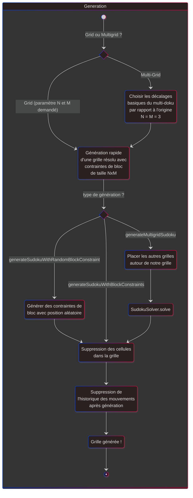

## Détails des fonctions utiles à la génération

Nous présenterons dans cette section trois fonctions importantes pour la génération de sudoku.

### Génération rapide de sudokus avec des contraintes de blocs de taille NxM

Notre approche se base sur des sudokus déjà résolus et stockés dans un fichier conforme.
Le cas échéant, nous effectuons une génération traditionnelle.
Si un tel fichier existe et est conforme au type de sudoku demandé, nous allons mélanger astucieusement pour obtenir une
grille de sudoku résolu, mais totalement aléatoire.
Pour une grille de sudoku avec des contraintes de blocs de taille NxM déjà résolue :

- On mélange les lignes de blocs de contraintes, ce qui nous ajoute `M!` possibilités
- On mélange les colonnes de blocs de contraintes, ce qui nous ajoute `N!` possibilités
- On mélange les lignes au sein de chaque bloc de contraintes, ce qui nous ajoute `N!` possibilités
- On mélange les colonnes au sein de chaque bloc de contraintes, ce qui nous ajoute `M!` possibilités
- On mélange tous les symboles, ce qui nous ajoute `(NxM)!` possibilités

---

**Ainsi, nous obtenons un nombre de possibilités de `M!² * N!² * (NxM)!` pour une grille de sudoku de taille NxM, ce qui
représenterait plus de [470 millions de possibilités]{.underline} de grilles résolues avec [une unique solution]
{.underline} à partir d'une unique grille de sudoku pré résolues de taille 9x9.**

---

Voici le diagramme d'activité illustrant le processus de génération rapide de sudoku :

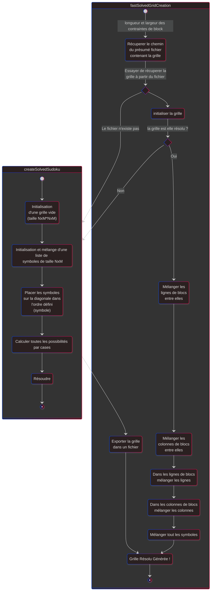

### Génération des contraintes pour un sudoku avec des contraintes de blocs de NxM :

Une fois une grille résolue générée, nous pouvons éventuellement faire en sorte que les contraintes de bloc comme ceci :

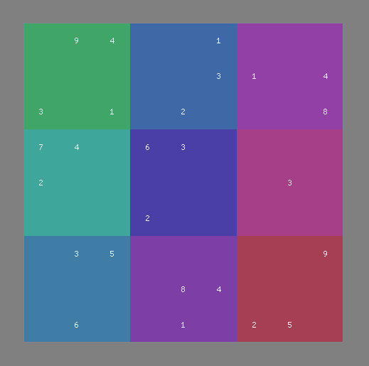

Puisse avoir des contraintes de blocs "mélangées" comme ceci :

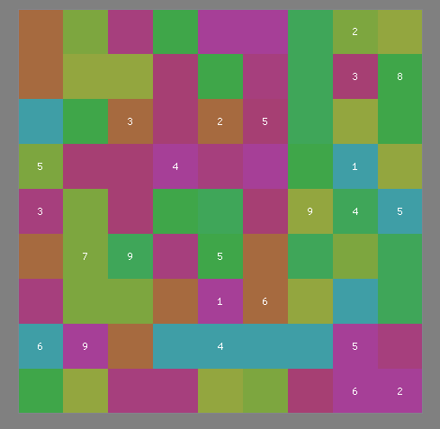

Pour ce faire, il suffit de respecter un principe simple :

---

**Si une case d'un bloc des contraintes contient un symbole équivalent à un symbole d'un autre bloc de contraintes,
alors les cases de ces deux blocs de contraintes peuvent s'interchanger.**

---

_Exemple :_

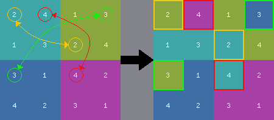

_Voici le diagramme d'activité représentant le fonctionnement de la fonction :_

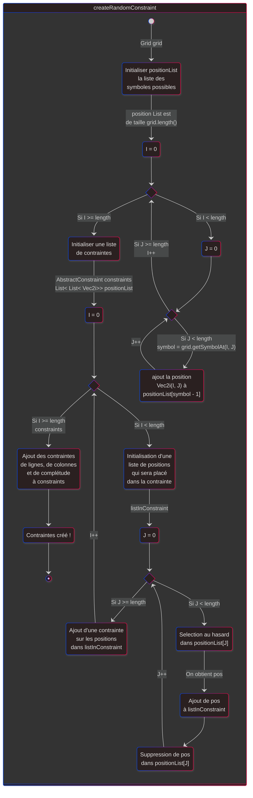

### Suppression des cellules dans un Solvable résolu :

Dans l'objectif de générer des grilles à faire résoudre par l'utilisateur, nous devons être en mesure de supprimer des
cellules de la grille précédemment résolue, tout en gardant l'unicité de la solution.

C'est dans cet objectif que nous avons créé la fonction `removeRandomCells` qui permet de supprimer des cellules
aléatoirement dans une grille résolue, tout en gardant l'unicité de la solution.

Cette fonction est très importante pour la génération, car elle est au cœur du processus de génération et est la
fonction qui va couter le plus de temps à s'exécuter.

Nous avons optimisé le processus en plaçant plusieurs cellules simultanément avant de tenter de résoudre le Sudoku.
Initialement, nous plaçons un lot de cellules de taille égale à $sqrt(n)$ (où $n$ est la taille du Sudoku). Si la
solution n'est pas unique, nous annulons le dernier lot et réduisons de moitié la taille du lot suivant, jusqu'à poser
les cellules une par une si nécessaire. (Cette optimisation n'est pas représentée dans le diagramme de séquence.)

_Voici le diagramme de séquence de cette fonction pour mieux comprendre ce qu'il se passe :_

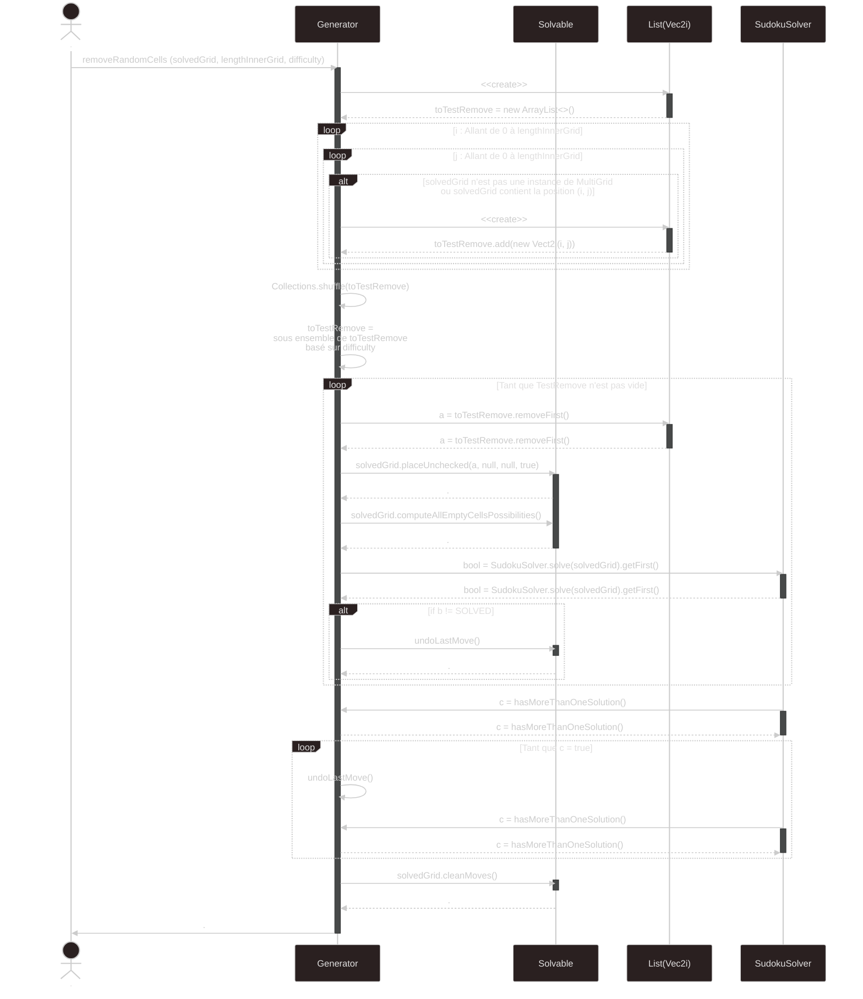

---

# Comparaison des performances de génération de début de projet → fin de projet

## Résultat de la vitesse de génération de début de projet

Les résultats sont en fonction de la taille de la grille (Échantillon de 50 générations).

| Taille | Moyenne | Minimum | Maximum | Médiane |
|:------:|:-------:|:-------:|:-------:|:-------:|
|  4x4   |   4ms   |   1ms   |  33ms   |   3ms   |
|  9x9   |  474ms  |  13ms   | 14324ms |  117ms  |

*Nous n'avons testé uniquement le 4x4 et le 9x9 ont été testés, les grilles de tailles supérieures mettant trop de temps
pour pouvoir effectuer des tests corrects sur un échantillon de cette taille.*

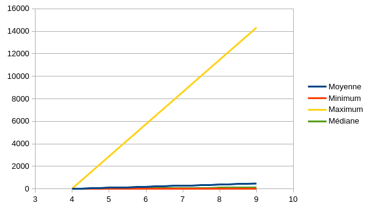

## Résultat de la vitesse de génération rapide actuelle

Les résultats sont en fonction de la taille de la grille (Échantillon de 50 générations).

| Taille | Moyenne | Minimum | Maximum | Médiane |
|:------:|:-------:|:-------:|:-------:|:-------:|
|  4x4   |   5ms   |   2ms   |  79ms   |   3ms   |
|  9x9   |  31ms   |  20ms   |  77ms   |  28ms   |
| 16x16  |  472ms  |  390ms  |  676ms  |  465ms  |
| 25x25  | 5380ms  | 4490ms  | 6144ms  | 5368ms  |
| 36x36  | 38224ms | 34740ms | 41455ms | 38309ms |

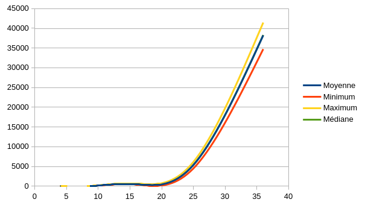

---

**On remarque dès lors que la génération actuelle est plus rapide, mais surtout bien plus constante, ce qui est un
avantage non négligeable pour l'utilisateur.**

En effet, la génération de grilles de taille plus élevée entrainait une grande différence Min/Max dans la manière
précédente de générer nos grilles avec la méthode conventionnelle, ce qui n'est plus le cas avec la génération actuelle.

---

# Répartition

Pour ce projet, nous nous sommes repartis les tâches en tirant parti des compétences de chacun.

- Guillaume s'est occupé de concevoir et d'implémenter la résolution de sudoku. Il a également réalisé l'interface
  graphique avec ImGUI et a grandement participé aux différentes réorganisations du code.
- Thibaut s'est quant à lui occupé de l'interface graphique via swing, qui a ensuite été abandonnée, car non adaptée
  pour l'affichage de multi-doku. Il a également mis au propre la conception élaborée par l'équipe sous forme de
  diagramme mermaid.
  Il s'est de plus occupé en collaboration avec Eymeric de la génération de sudoku, et plus particulièrement de la
  génération des contraintes de blocs déstructurés ainsi que de la génération accélérée via des grilles préremplies.
- Eymeric de son côté, s'est occupé de l'interface en console ainsi que de la génération des sudokus. Il a par ailleurs
  réalisé plusieurs réorganisations afin de simplifier le code, la grande majorité des tests unitaires et la pipeline
  GitHub actions pour vérifier ces tests à chaque push.

# Extensions

- Environnement de travail : [github](https://github.com/FlashOnFire/SUUUUUUUUUUUudoku)
    - Nous avons pris soin de respecter le [nommage conventionnel des commits](https://www.conventionalcommits.org)


- Tests unitaires
    - Toutes les fonctions importantes du projet sont testées à l'aide de plusieurs tests unitaires afin d'éviter toute
      régression


- Pipeline de test automatique avec GitHub, actions et nix
    - Nous avons réalisé des configurations nix (flake + package) afin d'avoir un environnement de développement
      identique entre tous les développeurs.
    - Cela nous a permis de simplement créer un pipeline GitHub action qui lance la compilation du projet ainsi que les
      tests (dans le même environnement que les développeurs) et envoie un e-mail en cas de problème.


- Interface graphique
    - Nous avons réalisé deux interfaces graphiques.
        - Une première avec Swing, abandonnée à mi-projet par la découverte d'un autre outil plus puissant
        - Une seconde avec imGUI une librairie C++ à l'origine avec des bindings Java.
          C'est cette interface qui est privilégiée à ce jour.
          Elle a permis d'intégrer les multi-doku plus simplement


- Fichier de configuration et de sauvegarde
    - Nous avons créé des méthodes permettant d'importer et d'exporter des sudokus ainsi que des multi-doku dans des
      fichiers `.csv`. Cela nous sert pour les tests ainsi que pour accélérer la génération.
      Cependant, ces fichiers sont intégrés dans le fichier .jar ce qui ne permet pas facilement de les modifier. Et,
      par manque de temps, nous n'avons pas intégré la possibilité de les charger depuis un autre endroit que les
      ressources du jar.


- Grilles avec multiples solutions :
    - La fonction permettant de trouver toutes les solutions existe et est testée et fonctionnelle, cependant, elle
      n'est pas utilisée, car cela aurait demandé de lourdes modifications dans les interfaces d'affichage.


- Rajout de contraintes :
    - L'architecture de l'application est pensée pour pouvoir ajouter des contraintes simplement.
    - Cela nous a permis d'ajouter une contrainte sur une liste de position qui est, en quelque sorte une contrainte de
      bloc déstructuré (les éléments du bloc sont éclatés à travers la grille).


- Résolution par l'humain :
    - L'interface ImGUI prend en charge la résolution d'un sudoku par l'utilisateur, avec une possibilité d'avoir de l'
      aide si l'on est en difficulté.


- Génération de grille optimale
    - Vous pouvez générer une grille de sudoku de taille avec des performances raisonnables (6 s) jusqu'à 25x25.
    - Voir les diagrammes de générateur pour les détails sur la méthode utilisée


- Résolution de grille
    - Vous pouvez résoudre une grille de sudoku de taille avec des performances raisonnables jusqu'à 100x100.
    - Vous pouvez également résoudre des multigrilles efficacement


- Consulter l'historique des modifications
    - Vous pouvez consulter l'historique des modifications de la grille.
      Particulièrement utile pour les résolutions automatiques.


- Résolution manuelle
    - Vous pouvez résoudre une grille de sudoku de manière manuelle


- Interface en ligne de commande ergonomique
    - Vous pouvez utiliser une interface en ligne de commande pour jouer au sudoku avec une ergonomie proche de
      l'interface graphique
