## Tutoriel utilisation

### Prérequis

Si vous n'utilisez pas nix, les prérequis sont :

- `openjdk-23`
- `gradle`
- `libGL`

### Jar précompilés

Vous pouvez lancer les fichiers en .jar dans le dossier build

```bash
java -jar ./build/libs/imGUI-1.0.jar # Interface graphique avec imGUI
java -jar ./build/libs/tui-1.0.jar # Interface en ligne de commande
java -jar ./build/libs/swing-1.0.jar # Interface graphique avec swing
```

### Compilation

#### Utilisateur nix

La méthode privilégiée pour lancer le programme est d'utiliser nix, car celui-ci vous assure d'avoir un environnement
identique aux autres utilisateurs de nix.
Si vous disposez de nix, vous pouvez lancer la compilation avec la commande suivante :

```bash
nix build
```

Vous pouvez ensuite lancer les différents exécutables avec les commandes suivantes :

```bash
./result/bin/tui # Interface en ligne de commande
./result/bin/imGUI # Interface graphique avec imGUI
./result/bin/swing # Interface graphique avec swing
```

#### Utilisateur Linux classique

Vous pouvez lancer la compilation avec la commande suivante :

```bash
./gradlew buildAllJars
```

Vous pouvez ensuite lancer les différents exécutables avec les commandes suivantes :

```bash
java -jar ./build/libs/imGUI-1.0.jar # Interface graphique avec imGUI
java -jar ./build/libs/tui-1.0.jar # Interface en ligne de commande
java -jar ./build/libs/swing-1.0.jar # Interface graphique avec swing
```

## Méthodologie

### Articulation conception codage

Pour aborder ce projet, nous avons commencé, après avoir lu attentivement le cahier des charges, par réaliser un diagramme de cas d'utilisation afin de s'assurer que chaque membre du groupe a parfaitement compris les objectifs requis de l'application.
Cela nous a permis d'aborder sereinement notre diagramme de classe pour anticiper au mieux l'architecture de notre code.

Voici le diagramme de cas d'utilisation réalisé au début du projet :


#### Diagramme de classe

Nous avons préféré garder un diagramme de classe le plus minimaliste possible au début, car nous savons par expérience que nous devons toujours réorganiser le code plusieurs fois lors de son développement.
Éviter de trop architecturer le projet permet de rester agile et de l'adapter au fur et à mesure.
Nous avons ensuite actualisé ce diagramme au fur et à mesure du projet afin d'avoir une vue d'ensemble des notre organisation et de voir simplement les points améliorables et les répétitions dans notre code.

Voici le diagramme de classe final mis à jour le 07/02/2025 :

```mermaid
---
config:
layout: elk
---
classDiagram
    direction TB
    namespace Ui {
        class ImGUIFrame {
            Integer? currentSymbol
            + ImGUIFrame()
            - drawGrid(Grid, Vec2i, ImVec2) void
            # configure(Configuration) void
            - keyPress(int) void
            - setSelection(int, int) void
            + main(String[]) void
            # preRun() void
            - drawMultiGrid(MultiGrid, Vec2i, ImVec2) void
            - applyLastChanges() void
            - handleInput() void
            + process() void
        }
        class Tui {
            + Tui()
            - welcomeMessage() void
            - displayGrid(Grid, Vec2i) void
            - play(Solvable~?~) void
            - showTimeLine(int, int) void
            + main(String[]) void
            - stopLoader() void
            - selectMode(String[]) int
            ~ start() void
            - startLoader() void
            - gameOver() void
            - cleanTerminal() void
            - solve(Solvable~?~) Solvable~?~
            - displayMultiGrid(MultiGrid) void
            - showHelper() void
            - displayOptions(String[], int) void
        }
        class SudokuOptions {
            + SudokuOptions(Color, Runnable, Runnable, Runnable, Runnable, Runnable, Runnable)
            - applyMaterialDesign(JButton) void
        }
        class SudokuFrame {
            + SudokuFrame(Grid)
            + main(String[]) void
            - updateJpanel() void
        }
        class SudokuBoard {
            ~ SudokuBoard(Grid)
            + recoverPreviousSudoku(Grid) void
            + update(Integer[][], boolean) void
        }
        class ObservableGrid {
            - Grid grid
            Map~Vec2i, Set~ Integer~~ emptyCellsPossibilities
            Grid grid
            Vec2i size
            List~Move2i~ moves
            + ObservableGrid(Grid, GridListener)
            + computeAllEmptyCellsPossibilities() void
            + placeUnchecked(Vec2i, Integer, boolean, boolean) void
            + undoLastMove(boolean) void
            + cleanMoves() void
            + areConstraintsSatisfied(boolean) boolean
            + shallowCopy() ObservableGrid
            + getSymbolAt(Vec2i) Integer
        }
        class GridListener {
            + onGridChange(InnerGrid) void
        }
    }
    namespace Constraints {
        class GeneralSymbolConstraint {
            - Vec2i[] positionList
            Vec2i[] positionList
            + GeneralSymbolConstraint(Set~Integer~, Vec2i[])
            + isSatisfied(InnerGrid) boolean
            - extractValues(InnerGrid) Set~Integer~
            + isPosAffected(Vec2i) boolean
            - isInPositionList(Vec2i) boolean
            + isAffectedBy(Vec2i, Vec2i) boolean
            + getPossibilities(InnerGrid, Vec2i) Optional~Set~Integer~~
        }
        class DiagonalConstraint {
            + DiagonalConstraint(Set~Integer~)
            + isAffectedBy(Vec2i, Vec2i) boolean
            + isSatisfied(InnerGrid) boolean
            + getPossibilities(InnerGrid, Vec2i) Optional~Set~Integer~~
            + isPosAffected(Vec2i) boolean
        }
        class BlockConstraint {
            Box2D block
            + BlockConstraint(Set~Integer~, Box2D)
            + isAffectedBy(Vec2i, Vec2i) boolean
            + isSatisfied(InnerGrid) boolean
            - extractBlock(InnerGrid) Set~Integer~
            + isInBlock(Vec2i) boolean
            + getPossibilities(InnerGrid, Vec2i) Optional~Set~Integer~~
            + equals(Object) boolean
            + hashCode() int
            + isPosAffected(Vec2i) boolean
        }
        class AbstractConstraint {
            + isSatisfied(InnerGrid) boolean
            + isAffectedBy(Vec2i, Vec2i) boolean
            + getPossibilities(InnerGrid, Vec2i) Optional~Set~Integer~~
            + isPosAffected(Vec2i) boolean
            + getClassicConstraints(int, Set~Integer~) List~AbstractConstraint~
            + getRectConstraints(int, int, Set~Integer~) List~AbstractConstraint~
        }
        class NotEmptyConstraint {
            + NotEmptyConstraint()
            + isAffectedBy(Vec2i, Vec2i) boolean
            + isPosAffected(Vec2i) boolean
            + getPossibilities(InnerGrid, Vec2i) Optional~Set~Integer~~
            + isSatisfied(InnerGrid) boolean
        }
        class LineConstraint {
            + LineConstraint(Set~Integer~)
            + isPosAffected(Vec2i) boolean
            + isSatisfied(InnerGrid) boolean
            + isAffectedBy(Vec2i, Vec2i) boolean
            + getPossibilities(InnerGrid, Vec2i) Optional~Set~Integer~~
        }
        class ColumnConstraint {
            + ColumnConstraint(Set~Integer~)
            + isSatisfied(InnerGrid) boolean
            + isAffectedBy(Vec2i, Vec2i) boolean
            + getPossibilities(InnerGrid, Vec2i) Optional~Set~Integer~~
            + isPosAffected(Vec2i) boolean
        }
    }
    namespace UtilsNamespace {
class Box2D {
+ Box2D(Vec2i, Vec2i)
+ Box2D(int, int, int, int)
+ absolute() Box2D
+ x() int
+ dx() int
+ overlap(Box2D) Box2D
+ height() int
+ contains(Vec2i) boolean
+ absolute(int, int, int, int) Box2D
+ dy() int
+ width() int
+ offset(int, int) Box2D
+ equals(Object) boolean
+ hashCode() int
+ contains(int, int) boolean
+ substract(Box2D) Box2D
+ y() int
}
class Vec2i {
- int x
- int y
int x
int y
+ Vec2i(Vec2i)
+ Vec2i(int, int)
+ zero() Vec2i
+ equals(int, int) boolean
+ random(int, int) Vec2i
+ equals(Object) boolean
+ substract(Vec2i) Vec2i
+ absolute() Vec2i
+ toString() String
+ hashCode() int
+ add(Vec2i) Vec2i
}
class Move2i {
+ Move2i(Vec2i, Integer, Integer)
+ position() Vec2i
+ toString() String
+ previous_value() Integer
+ value() Integer
}
class Pair~K, V~ {
- K first
- V second
K first
V second
+ Pair(K, V)
}
class Difficulty {
String[] values
int value
+ Difficulty()
+ fromInt(int) Difficulty
+ values() Difficulty[]
+ valueOf(String) Difficulty
}
class CsvUtils {
+ CsvUtils()
+ exportGrid(Path, Grid) void
+ importMultiGrid(Path) MultiGrid
+ importGrid(Path) Integer[][]
+ exportMultiGrid(Path, MultiGrid) void
}
class Main {
+ Main()
+ main(String[]) void
}
class Utils {
+ Utils()
+ hslToRgb(float, float, float) int[]
+ applyMapping(O[][], M[][], HashMap~O, M~) void
}
}
namespace GridNamespace {
class Grid {
- ArrayList~Move2i~ moves
- InnerGrid innerGrid
~ List~AbstractConstraint~ constraints
- HashMap~Vec2i, Set~ Integer~~ emptyCellsPossibilities
InnerGrid innerGrid
Vec2i size
List~Move2i~ moves
Set~Integer~ symbols
List~AbstractConstraint~ constraints
HashMap~Vec2i, Set~ Integer~~ emptyCellsPossibilities
+ Grid(Integer[][], Set~Integer~)
+ Grid(Grid)
+ Grid(Integer[][], Set~Integer~, int, int)
+ Grid(Integer[][], List~AbstractConstraint~, Set~Integer~)
+ computeAllEmptyCellsPossibilities() void
+ placeUnchecked(Vec2i, Integer, boolean, boolean) void
+ areConstraintsSatisfied(boolean) boolean
+ getSymbolAt(Vec2i) Integer
+ tryPlace(Vec2i, Integer, boolean, boolean) boolean
+ display() void
+ getSymbolAt(int, int) Integer
+ length() int
+ undoLastMove(boolean) void
+ shallowCopy() Grid
+ computeChangedEmptyCellsPossibilities(Vec2i, boolean) void
+ cleanMoves() void
+ applyNakedPairs() boolean
}
class InnerGrid {
+ InnerGrid(Integer[][])
+ InnerGrid(InnerGrid)
+ set(Vec2i, Integer) void
+ get() Integer[][]
+ display() void
+ length() int
+ computeEmptyCells() HashSet~Vec2i~
+ at(Vec2i) Integer
+ hashCode() int
+ equals(Object) boolean
}
class MultiGrid {
- Grid[] grids
- Vec2i[] paddings
- Vec2i size
- List~Move2i~ moves
- HashMap~Vec2i, Set~ Integer~~ emptyCellsPossibilities
Vec2i[] randomPadding
Map~Vec2i, Set~ Integer~~ emptyCellsPossibilities
Vec2i size
List~Move2i~ moves
Vec2i[] paddings
Grid[] grids
+ MultiGrid(List~Pair~ Vec2i, Grid~~)
+ MultiGrid(MultiGrid)
+ getGridFor(int, int) Pair~Integer, Grid~
+ fillOverlappingCells() void
+ computeAllEmptyCellsPossibilities() void
+ areConstraintsSatisfied(boolean) boolean
+ placeUnchecked(Vec2i, Integer, boolean, boolean) void
+ cleanMoves() void
+ isNotInGrid(Vec2i) boolean
+ undoLastMove(boolean) void
+ shallowCopy() MultiGrid
+ gatherEmptyCellsPossibilities() void
+ isInGrid(Vec2i) boolean
+ getSymbolAt(Vec2i) Integer
+ display() void
}
class Solvable~T~ {
~ Set~Integer~ symbols
boolean solved
Map~Vec2i, Set~ Integer~~ emptyCellsPossibilities
Vec2i size
List~Move2i~ moves
Set~Integer~ symbols
# Solvable(Set~Integer~)
+ cleanMoves() void
+ areConstraintsSatisfied(boolean) boolean
+ getSymbolAt(Vec2i) Integer
+ shallowCopy() T
+ undoLastMove(boolean) void
+ computeAllEmptyCellsPossibilities() void
+ placeUnchecked(Vec2i, Integer, boolean, boolean) void
}
class SymbolSets {
+ SymbolSets()
+ generateSymbols(int) Set~Integer~
}
 }
namespace Solver {
class SolvingState {
+ SolvingState()
+ values() SolvingState[]
+ valueOf(String) SolvingState
 }
class Generator {
+ Generator()
- removeRandomCells(T, int, Difficulty) void
+ fastSolvedGridCreation(int, int) Grid
~ createRandomConstraints(Grid) List~AbstractConstraint~
+ createExempleSolvedSudoku(int, int) Grid
+ generateSudokuWithBlockConstraints(int, int, Difficulty) Grid
+ generateClassicSudoku(int, Difficulty) Grid
+ printGrid(Integer[][]) void
+ generateSudokuWithRandomBlockConstraint(int, Difficulty) Grid
+ generateMultigridSudoku(int, int, Difficulty) MultiGrid
- findDividers(int) Vec2i
- createSolvedSudoku(int, int) Grid
}
class SudokuSolver_copy_1["SudokuSolver"] {
+ SudokuSolver()
+ findAllSolutions(T, boolean, boolean, boolean) List~T~
+ hasMoreThanOneSolution(T, boolean, boolean) boolean
- solveDeduction(T, boolean) SolvingState
+ solve(T, boolean, boolean, boolean) Pair~SolvingState, T~
- doBacktracking(T, boolean) List~T~
}
 }
<<Interface>> AbstractConstraint
<<enumeration>> Difficulty
<<Interface>> GridListener
<<enumeration>> SolvingState
SudokuFrame ..> SudokuOptions: «create»
BlockConstraint ..> AbstractConstraint
ColumnConstraint ..> AbstractConstraint
CsvUtils ..> Grid: «create»
CsvUtils ..> MultiGrid: «create»
DiagonalConstraint ..> AbstractConstraint
GeneralSymbolConstraint ..> AbstractConstraint
Generator ..> ColumnConstraint: «create»
Generator ..> GeneralSymbolConstraint: «create»
Generator ..> Grid : «create»
Generator ..> LineConstraint: «create»
Generator ..> MultiGrid: «create»
Generator ..> NotEmptyConstraint: «create»
Grid "1" *--> "constraints *" AbstractConstraint
Grid ..> InnerGrid : «create»
Grid "1" *--> "innerGrid 1" InnerGrid
Grid --> Solvable
ImGUIFrame ..> Grid: «create»
ImGUIFrame ..> ObservableGrid: «create»
ImGUIFrame "1" *--> "originalSolvable 1" Solvable
LineConstraint ..> AbstractConstraint
MultiGrid "1" *--> "grids *" Grid
MultiGrid --> Solvable
NotEmptyConstraint ..> AbstractConstraint
ObservableGrid "1" *--> "grid 1" Grid
ObservableGrid "1" *--> "listener 1" GridListener
ObservableGrid --> Solvable
SudokuBoard "1" *--> "previousGrid 1" Grid
SudokuBoard ..> Grid: «create»
SudokuFrame "1" *--> "grid 1" Grid
SudokuFrame ..> Grid: «create»
SudokuFrame ..> SudokuBoard: «create»
SudokuFrame "1" *--> "board 1" SudokuBoard
Tui ..> Grid: «create»
Tui ..> MultiGrid: «create»
```



### Répartition

Pour ce projet, nous nous sommes repartis les tâches en tirant parti des compétences de chacun.

- Guillaume s'est occupé de concevoir et d'implémenter la résolution de sudoku. Il a également réalisé l'interface graphique avec ImGUI et a grandement participé aux différentes réorganisations du code.
- Thibaut s'est quant à lui occupé de l'interface graphique via swing qui a ensuite été abandonné, car non adapté pour l'affichage de multi-doku.
Il s'est pareillement occupé en collaboration avec Eymeric de la génération de sudoku, et plus particulièrement de la génération des contraintes de blocs déstructurés ainsi que la génération accélérée via des grilles préremplies.
- Eymeric de son côté, s'est occupé de l'interface en console ainsi que de la génération des sudokus. Il a par ailleurs réalisé plusieurs réorganisations afin de simplifier le code. Et la pipeline GitHub actions pour vérifier les tests unitaires à chaque push.


## Extensions

- Environnement de travail : [github](https://github.com/FlashOnFire/SUUUUUUUUUUUudoku)
	+ Nous avons pris soin de respecter le nommage conventionnel des commits
- Tests unitaires
	+ Toutes les fonctions importantes du projet sont testées à l'aide de plusieurs tests unitaires
- Pipeline de test automatique avec GitHub, actions et nix
	+ Nous avons réalisé des configurations nix (flake + package) afin d'avoir un environnement de développement identique entre tous les développeurs.
	+ Cela nous a permis de simplement créer un pipeline GitHub action qui lance la compilation du projet ainsi que les tests et envoie un e-mail en cas de problème.
- Interface graphique
	+ Nous avons réalisé deux interfaces graphiques.
		* Une première avec Swing, abandonnée à mi-projet par la découverte d'un autre outil plus puissant
		* Une seconde avec imGUI une librairie C++ à l'origine avec des bindings Java. C'est cette interface qui est privilégiée à ce jour.
		Elle a permis d'intégrer les multi-doku plus simplement

- Fichier de config et sauvegarde (un peu)
	+ Nous avons créé des méthodes permettant d'importer et d'exporter des sudokus ainsi que des multi-doku. Cela nous sert pour les tests ainsi que pour accélérer la génération.
	+ Cependant, ces fichiers sont intégrés dans le fichier .jar ce qui ne permet pas facilement de les modifier. Et, par manque de temps, nous n'avons pas intégré la possibilité de les charger depuis un autre endroit que les ressources du jar.

- Grilles avec multiples solutions :
	+ La fonction permettant de trouver toutes les solutions existe, cependant, elle n'est pas utilisée, car cela aurait demandé de lourdes modifications dans les interfaces d'affichage.

- Rajout de contraintes :
	+ L'architecture de l'application est pensée pour pouvoir ajouter des contraintes simplement.
	+ Cela nous a permis d'ajouter une contrainte sur une liste de position qui est, en quelque sorte une contrainte de bloc déstructuré (les éléments du bloc sont éclatés à travers la grille).

- Résolution par l'humain FAUT VOIR !!!!!!!!!!!!!!!!!!!!!!!!!!!!!!!!!!!!!!!!!!!!!!!!!!!!!!!!!!!!!!!!!!!!!!!!!!!!!!!!!!!!!!!!!!!!!!!!!!!!!!!!!!!!!!!!!!!!

- Génération de grille optimal
	+ Vous pouvez générer une grille de sudoku de taille avec des performances raisonnables (6 s) jusqu'à 25x25.
	+ Voir les diagrammes de générateur pour les détails sur la méthode utilisée

- Résolution de grille
	+ Vous pouvez résoudre une grille de sudoku de taille avec des performances raisonnables jusqu'à 100x100.
	+ Vous pouvez également résoudre des multigrille efficacement

- Consulter l'historique des modifications
	+ Vous pouvez consulter l'historique des modifications de la grille.
	Particulièrement utile pour les résolutions automatiques.
- Résolution manuelle
	+ Vous pouvez résoudre une grille de sudoku de manière manuelle
- Interface graphique
	+ Vous pouvez utiliser une interface graphique pour jouer au sudoku
- Interface en ligne de commande ergonomique
	+ Vous pouvez utiliser une interface en ligne de commande pour jouer au sudoku avec une ergonomie proche de l'interface graphique